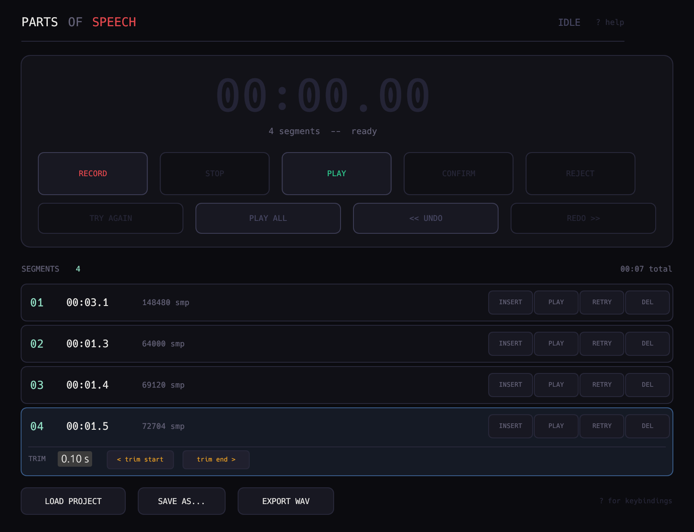
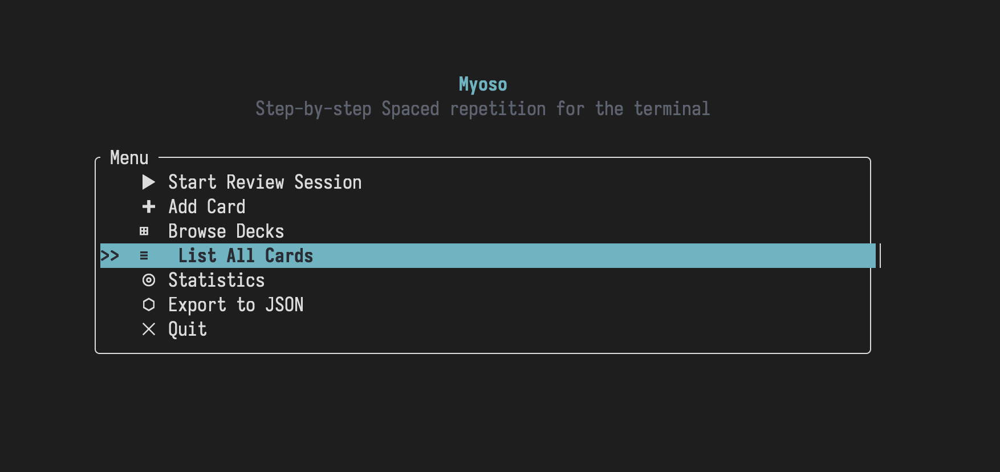
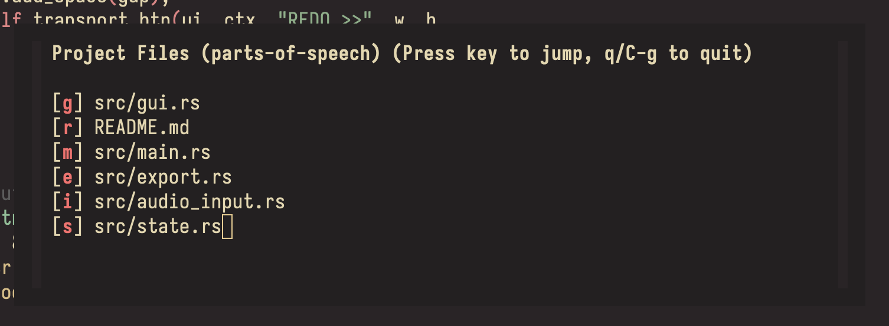
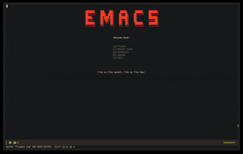
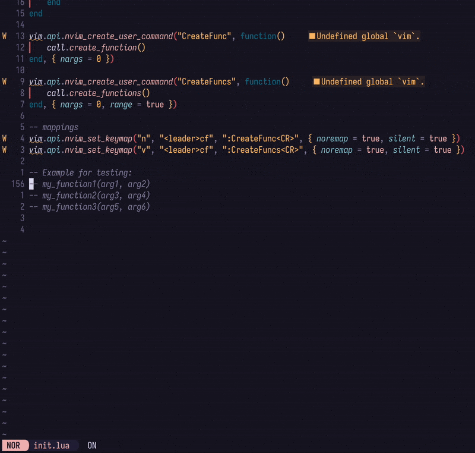

<h1 align=center>vmargb</h1>
<strong>Hi!</strong>

 
 

I am a Computer Science and AI graduate that works on cool open-source projects in my free time, feel free to look around! 
<ul>
   <li>I'm currently learning Haskell, Rust and Go</li>
   <li>I'm interested in functional programming & lambda calculus</li>
   <li>My favorite editor is Emacs (w/ Evil)</li>
</ul>
 

Support me over at <a href="https://ko-fi.com/vmargb" style="text-decoration: none; color: #FF5E5B;">ko-fi!</a>

 

<h3>
<pre>
//-----------------------------------------\\
|&nbsp;&nbsp;&nbsp;&nbsp;&nbsp;My currently maintained projects&nbsp;&nbsp;&nbsp;&nbsp;&nbsp;&nbsp;|
\\-----------------------------------------//
</pre>
</h3>

<h4>1. <a href="https://github.com/vmargb/parts-of-speech">Parts of Speech</a> ☆</h4>
<table>
   <tr>
      <td width="70%">
         A non-linear voice-over app written in Rust that lets you record your audio chunk by chunk with an improved workflow compared to traditional recording software. 
      </td>
      <td width="30%">
         
      </td>
   </tr>
</table>
   
<h4>2. <a href="https://github.com/vmargb/Myoso">Myoso</a> ☆</h4>
<table>
   <tr>
      <td width="70%">
         A unique alternative to the anki app on android. This is a TUI based flashcard app with additional features such as step-by-step chain of thought reasoning with spaced-repetition.
      </td>
      <td width="30%">
         
      </td>
   </tr>
</table>

<h3>
<pre>
//-----------------------------------------\\
|&nbsp;&nbsp;&nbsp;&nbsp;&nbsp;       Plugins & Packages       &nbsp;&nbsp;&nbsp;&nbsp;&nbsp;&nbsp;|
\\-----------------------------------------//
</pre>
</h3>
<h4>1. <a href="https://github.com/vmargb/arrow.el">arrow.el</a></h4>
<table>
   <tr>
      <td width="70%">
         An Emacs package implementation of arrow.nvim, designed to provide global, per-project, and per-buffer bookmarks that are fully isolated and persistent in memory.
      </td>
      <td width="30%">
         
      </td>
   </tr>
</table>

<h4>2. <a href="https://github.com/vmargb/project-x">project-x</a></h4>
<table>
   <tr>
      <td width="70%">
         Ehancements to Emacs' built in project.el library that lets you write and persist project sessions to disk and dynamically restore them just as you left them.
      </td>
      <td width="30%">
         
      </td>
   </tr>
</table>

<h4>3. <a href="https://github.com/vmargb/lookahead">Lookahead</a></h4>
<table>
   <tr>
      <td width="70%">
         A Firefox extension to help you find any website with its own scoring algorithm and a floating "picker" to quick-switch between your links.
      </td>
      <td width="30%">
         
      </td>
   </tr>
</table>

<h4>4. <a href="https://github.com/vmargb/funcy.nvim">funcy.nvim</a></h4>
<table>
   <tr>
      <td width="70%">
         A neovim plugin that uses LSP and Regex to dynamically create function and class declarations for you. Similar to the same feature in Jetbrains IDE's
      </td>
      <td width="30%">
         
      </td>
   </tr>
</table>

<h3>
<pre>
//----------------------------------\\
|&nbsp;&nbsp;&nbsp;&nbsp;&nbsp;Dotfiles & Configurations&nbsp;&nbsp;&nbsp;&nbsp;&nbsp;&nbsp;|
\\----------------------------------//
</pre>
</h3>

<h4>1. <a href="https://github.com/vmargb/nixos-config">NixOS (w/ Flakes & HM)</a></h4>
<table>
   <tr>
      <td width="70%">
         My modular NixOS configuration using Flakes and Home-Manager.
      </td>
      <td width="30%">
         
      </td>
   </tr>
</table>

 

<h3>
<pre>
//------------------------\\
|&nbsp;&nbsp;&nbsp;Old College Projects&nbsp;&nbsp;&nbsp;|
\\------------------------//
</pre>
</h3>

In my own time I've taken up several hobby projects, most of which are old College projects.

You can find some of these projects over at my older GitHub profile:

<ul>
   <li><a href="https://github.com/physicsKnight"><strong>Old GitHub</strong></a></li>
</ul>
