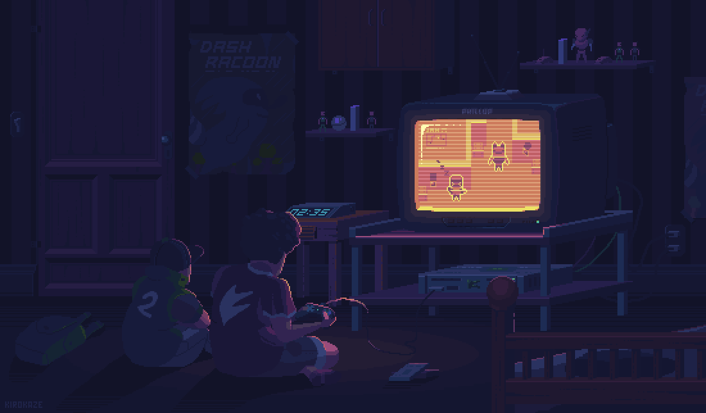

  <h1>vmargb</h1>
  
  

    <em>CS & AI grad • I write packages for fun • Open-source</em>
  

  

    <strong>Learning:</strong> Haskell, Rust, Go •
    <strong>Editor:</strong> Emacs (w/ Evil) •
    <strong>Interests:</strong> FP, Creative Coding
  

---

## Packages / Plugins

- **[arrow.el](https://github.com/vmargb/arrow.el)** – Global/per-project & buffer bookmarks for Emacs, inspired by arrow.nvim.
- **[project-x](https://github.com/vmargb/project-x)** – Persist and restore Emacs project sessions in memory.
- **[leitner.el](https://github.com/vmargb/leitner.el)** – Org-mode reviewing tool with the Leitner box system + SM-2.
- **[region-pin](https://github.com/vmargb/region-pin)** - Compact code snippets pinned at the top of your window. 
- **[Elline](https://github.com/vmargb/elline)** – Minimal and fast, highly optimized status line for Emacs.
- **[funcy.nvim](https://github.com/vmargb/funcy.nvim)** – Auto-generate function/class declarations using LSP + regex.
- **[Lookahead](https://github.com/vmargb/lookahead)** – Firefox extension for quick searching & link switching.

---

## Other Projects

### [Parts of Speech](https://github.com/vmargb/parts-of-speech)
> Non-linear voice recording app written in **Rust** that lets you record takes in controllable segments.

<!--

  

-->

### [Myoso](https://github.com/vmargb/Myoso)
> TUI spaced-repetition flashcard app with a **new** *step-by-step* problem solving approach, a unique alternative to Anki.
<!--

  

-->

---

## Dotfiles & Configs

### 🐧 [NixOS Config](https://github.com/vmargb/nixos-config)
> Dendritic NixOS configuration using Flakes and Home Manager.

---

## Archive: College Projects
Older hobby and university projects are available on my [legacy profile](https://github.com/physicsKnight).

---

  

